### Hi, this is a research repository by Naziru Halilu 👋


[](./LICENSE) 
[](https://doi.org/10.5281/zenodo.22741092)

**GIS Monitoring of Grape Moth (Lobesia botrana)**

A GIS practical exercise at Quinta da Senhora da Graca, a 42.97-hectare
vineyard estate in the Douro Demarcated Region, Portugal: terrain
characterisation, a mating-disruption pheromone programme, delta-trap
placement, and spatial capture-damage assessment across three flight
periods of the grape moth (Lobesia botrana).

📫 halilunaziru73@gmail.com

---

## Problem, Methodology, and Results

**Problem.** Lobesia botrana is the main economically damaging insect pest of vineyards in the Douro Demarcated Region, causing direct larval damage to grape clusters and indirect losses through secondary fungal rot. Effective, low-impact management requires knowing not just how many moths were caught, but where damage concentrates relative to terrain, so that mating-disruption and monitoring resources are placed where they matter most.

**Methodology.** Terrain was characterised from a digital elevation model (altitude, slope, aspect) for the full 42.97 ha property. A mating-disruption programme was costed using BIO_Otwin (R) pheromone diffusers at 350-400 diffusers/ha, with labour and material costs estimated per grape variety block. Twenty-five georeferenced delta traps were placed across the vineyard for spatial monitoring, and capture counts were related to observed damage across three flight periods (April/May, June/July, August/September), then interpreted against the terrain and land-use layers.

**Results.** The property spans an altitude range of 61-400 m (a 339 m difference) and a slope range of 0-111%, terrain heterogeneity that plausibly modulates local temperature, humidity, and pest pressure. The mating-disruption programme required 12,232-13,979 diffusers, 101.9-116.5 labour hours, and EUR 2,670.6-3,052.1 in total cost across the 11 grape-variety blocks, with the mixed-variety "Mistura de Castas" block requiring the most (3,022-3,453 diffusers). Capture and damage patterns varied by flight period, informing where monitoring effort and mating-disruption density should concentrate in subsequent seasons.

**Workflow sketch**

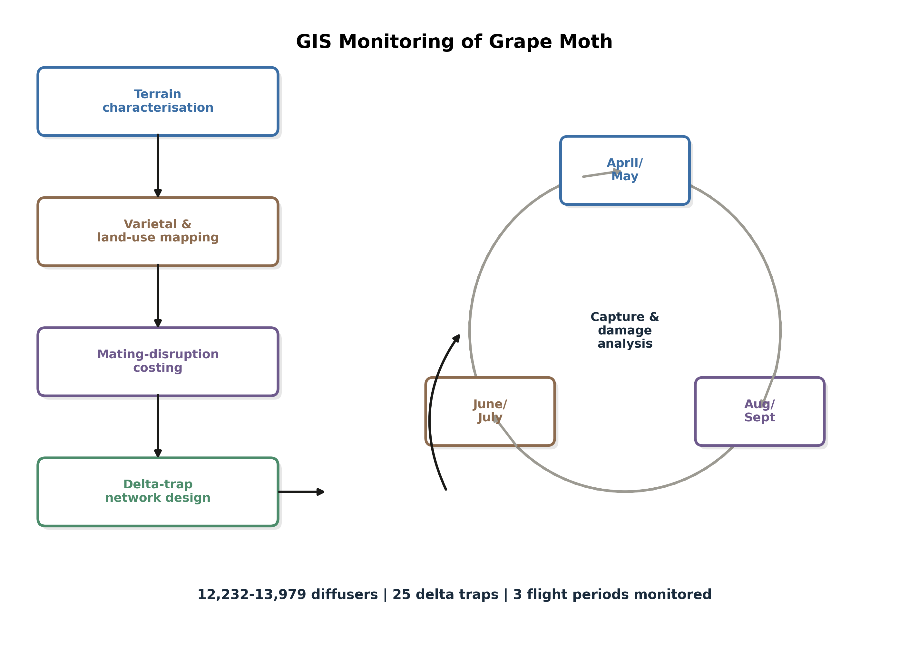

[View interactive graphical walkthrough →](https://halilunaziru73-creator.github.io/GIS-Monitoring-of-Grape-Moth-Vineyard-Pest/)

## Guide: Steps Followed

This is my own written account of the GIS workflow, not a reproduction of any
instructor-provided material. The course brief and reference documents used
to design this exercise are cited under **Acknowledgements** below but are
not redistributed in this repository.

1. **Project setup.** Created a QGIS project (`Geopackage/Naziru_Halilu_grape_moth_EXercise.qgz`) and organised farm boundary, land-cover, and point data as vector layers.
2. **Terrain characterisation.** Derived altitude, slope, and aspect surfaces from the digital elevation model to map the property's topographic heterogeneity.
3. **Land use and varietal mapping.** Digitised and classified vineyard blocks by grape variety and surrounding land-cover/occupation type.
4. **Mating-disruption costing.** Calculated pheromone diffuser requirements, labour hours, and installation costs per variety block at 350-400 diffusers/ha.
5. **Delta-trap network design.** Placed and georeferenced 25 delta traps across the property for spatially representative monitoring coverage.
6. **Spatial capture-damage analysis.** Related trap captures to observed vineyard damage across three flight periods (April/May, June/July, August/September) and interpreted the results against terrain and land-use context.
7. **Reporting.** Compiled findings, costings, and recommendations into a full written report (`Naziru_HALILU_Grape_Moth_Report.pdf`).

## Featuring QGIS Outputs Results

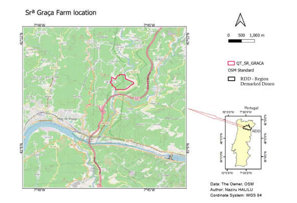
**Figure 1.** *Geographical and cartographic location of Quinta da Senhora da Graca within the Douro Demarcated Region.*

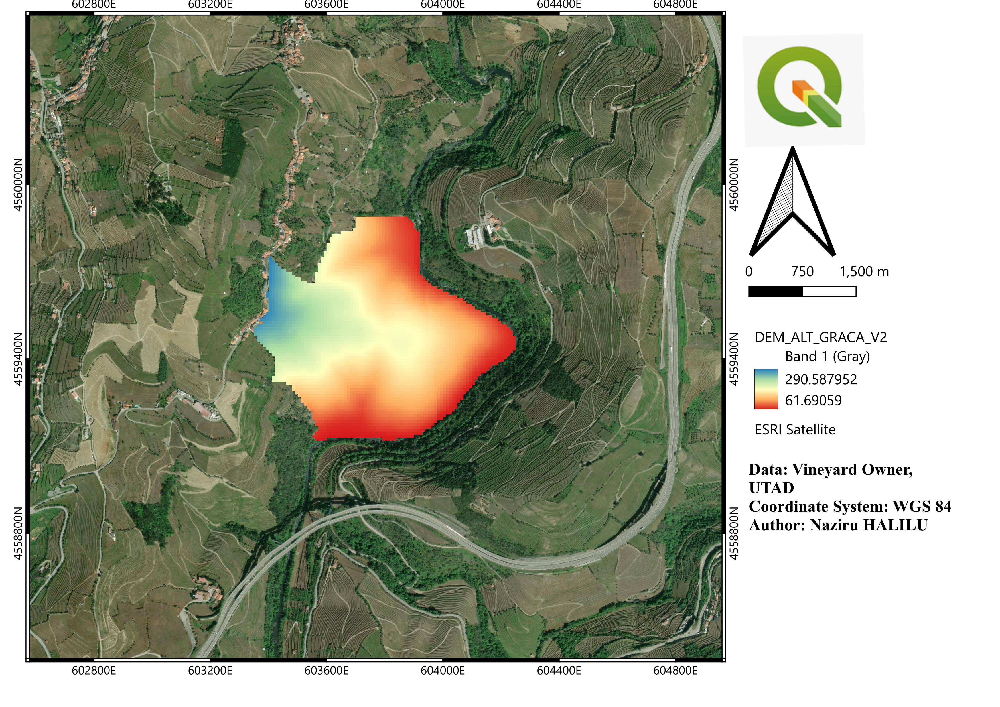
**Figure 2.** *Digital elevation model of the property.*

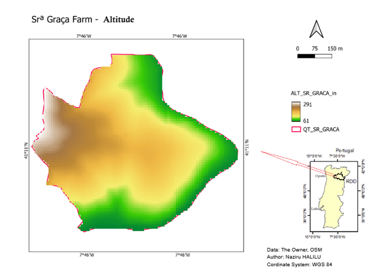
**Figure 3.** *Altitude variation across the estate (61-400 m range).*

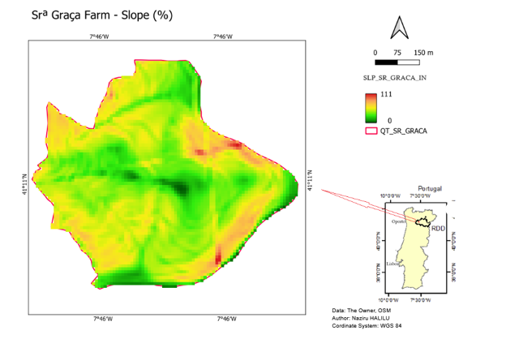
**Figure 4.** *Slope map (0-111% range), showing the steepest sections near the Corgo River.*

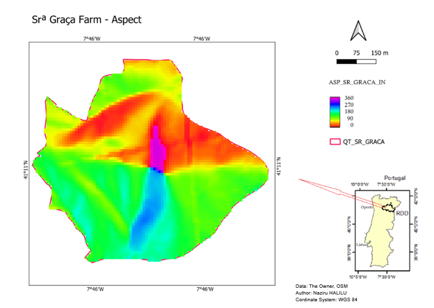
**Figure 5.** *Aspect model, capturing slope-facing direction across the property.*

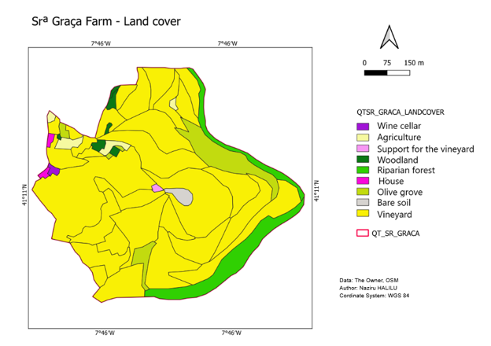
**Figure 6.** *Land use and land occupation classification of the estate.*

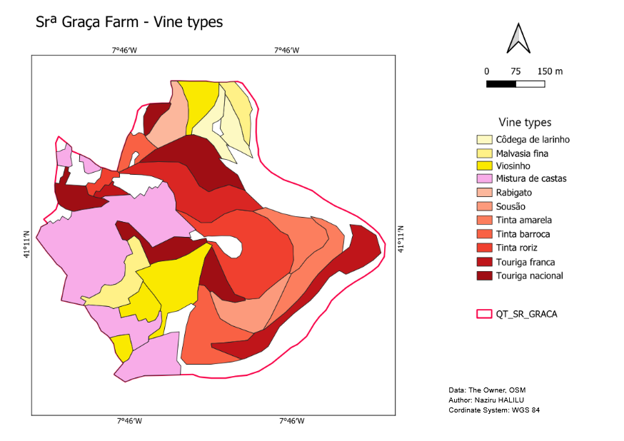
**Figure 7.** *Vineyard varietal composition (Cast/variety chart) across the property's 11 grape-variety blocks.*

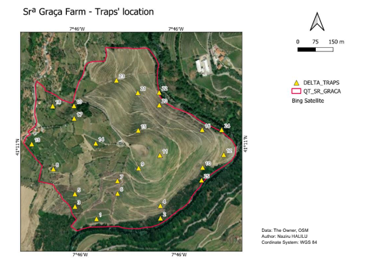
**Figure 8.** *Georeferenced locations of the 25 delta traps installed for Lobesia botrana monitoring.*

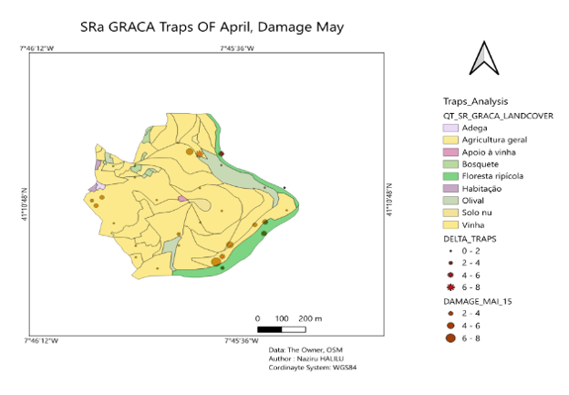
**Figure 9.** *Spatial distribution of Lobesia botrana captures and observed damage during the first flight period (April/May).*

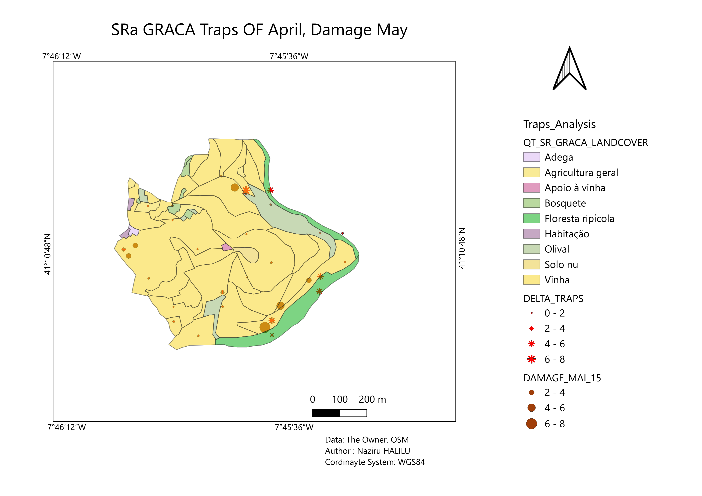
**Figure 10.** *Damage map for May.*

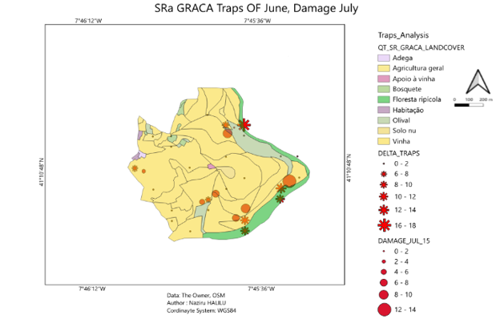
**Figure 11.** *Spatial distribution of captures and damage during the second flight period (June/July).*

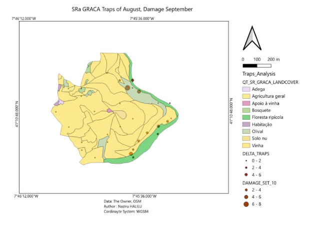
**Figure 12.** *Spatial distribution of captures and damage during the third flight period (August/September).*

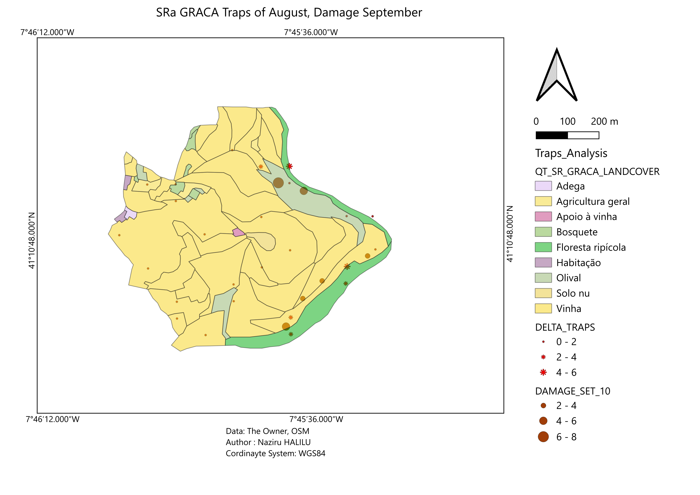
**Figure 13.** *Damage map for September.*

## Repository Structure

```
figures/                13 map layouts referenced above and in the README
Geopackage/              QGIS project file (.qgz)
DEM/                     Digital elevation model rasters
Grid/, Grid_v2/          Derived raster layers (slope, aspect, IDW interpolation, damage masks)
Shape/, Shape_v2/        Vector layers (farm boundary, land cover, delta traps, damage polygons)
DBF_XLS_CSV/             Tabular capture/damage data
Kml_shape/               KML export of the farm boundary
Styles/                  QGIS layer styling files (.qml)
Naziru_HALILU_Grape_Moth_Report.pdf   Full written report
```

## Acknowledgements

This exercise was completed as part of an Erasmus Mundus GIS course under the
supervision of Jose Tadeu Marques Aranha (UTAD). The course brief and
reference material provided for the exercise are not redistributed here;
this repository contains only my own analysis, outputs, and written report.

## License

Code and original written content in this repository are released under the
MIT License (see `LICENSE`). Underlying geospatial data were provided for
coursework purposes; redistribution beyond this academic context should
credit the original data sources noted in the report.
